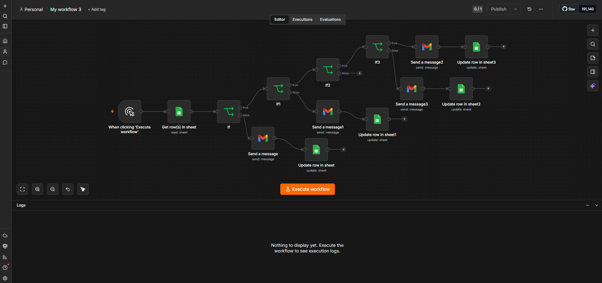
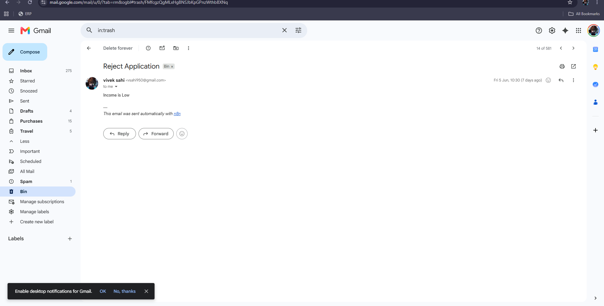
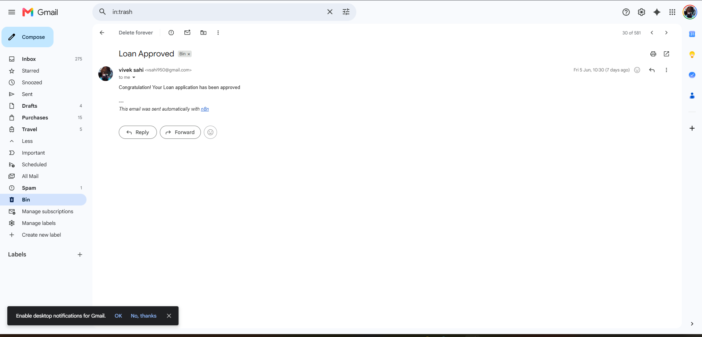
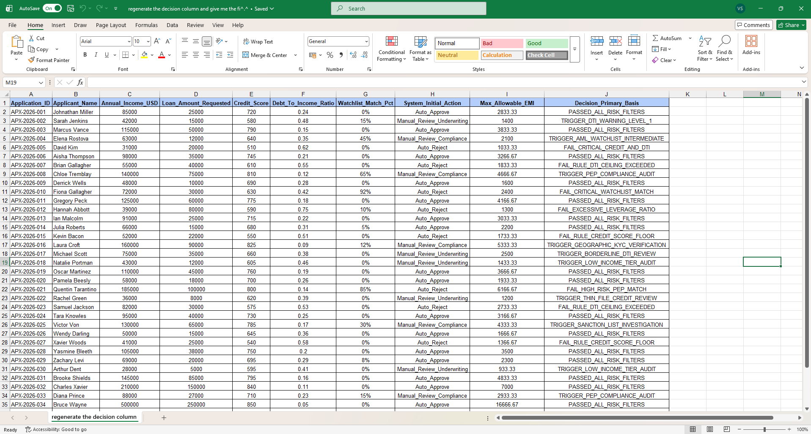

# Automated Credit Underwriting & Loan Decisioning Pipeline (n8n Workflow)

This repository contains an automated backend workflow designed in **n8n** that handles end-to-end credit scoring and loan application routing. It fetches applicant records from a Google Sheet database, evaluates risk metrics using structured conditional branching, triggers corresponding status emails via Gmail, and logs final underwriting actions back into the system.

## 🚀 Workflow Architecture

The visual implementation of the decision logic built in the n8n editor canvas:

### 📌 Node-by-Node Pipeline Breakdown
1. **Manual Trigger**: Initiates the orchestration layer manually for application batch processing.
2. **Get Row(s) in Sheet**: Pulls real-time applicant data fields including income, credit score, and watchlist percentages.
3. **Multi-Stage Risk Filters (`If`, `If1`, `If2`, `If3`)**:
   * **Annual Income Check (`If`)**: Filters out applicants with low financial capacity.
   * **Credit Score Check (`If1`)**: Flags high-risk profiles based on standard credit bureau baselines.
   * **Debt-To-Income (DTI) Check (`If2`)**: Analyzes total leverage ratios.
   * **Compliance Watchlist Check (`If3`)**: Segregates automated clearances from manual compliance checks.
4. **Gmail Integration**: Automatically drafts and fires customized transactional emails (`Approved`, `Rejected`, or `Under Review`).
5. **Google Sheets Database Updates**: Writes updated application flags, status mappings, and audit remarks back to the source records.

---

## 📊 Live System Results

### 📧 Email Verification Outputs
Below are the actual automated communication outputs received by applicants when the workflow processes automated rejection criteria versus standard approval criteria:

#### 1. Automated Application Rejection Notification

#### 2. Automated Application Approval Notification

---

## 📈 Underlying Database Architecture

The workflow processes live data fields structured across the loan underwriting sheets. Below is a sample slice of the database handled during execution:

### Main Data Columns Evaluated:
* `Annual_Income_USD` vs `Loan_Amount_Requested`
* `Credit_Score` & `Debt_To_Income_Ratio`
* `Watchlist_Match_Pct` (Compliance check)
* `System_Initial_Action` & `Decision_Primary_Basis`

---

## 🛠️ Deployment & Execution Steps

### Import Workflow File
1. Clone this repository to your local system.
2. Open your self-hosted or cloud **n8n** instance.
3. Click the top-right menu icon and select **Import from File**.
4. Upload the `My workflow 3 (1).json` file included in this directory.

### Credentials Setup
* **Google Sheets OAuth2 API**: Link your Google Workspace account to pull from your underwriting sheet ID.
* **Gmail OAuth2 API**: Authorize your email domain to dispatch automated response routing.
